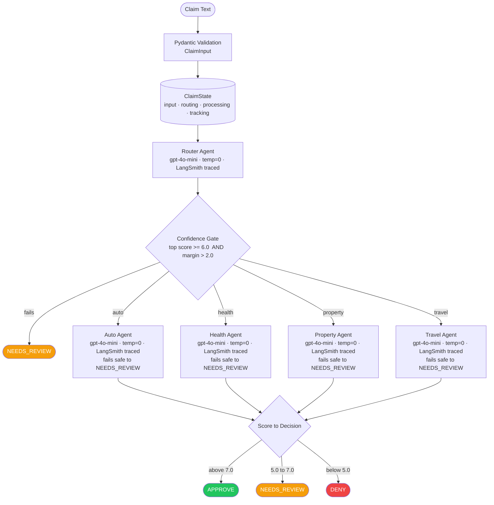
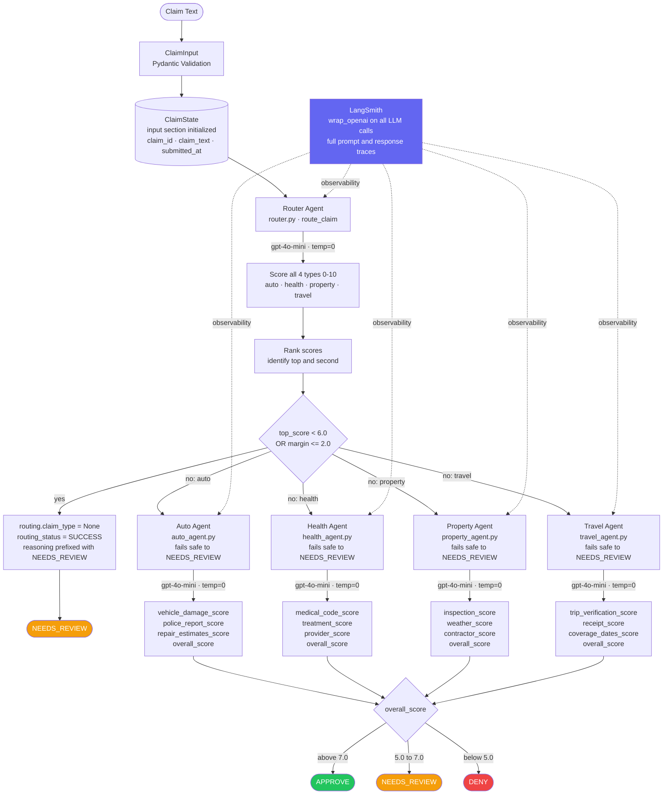

# Insurance Claim Processing Agent

A multi-agent AI system that classifies incoming insurance claims by type and routes each to a specialized evaluator, returning a scored decision of APPROVE, DENY, or NEEDS_REVIEW.

## The Problem

Insurance claim adjusters evaluate claims manually — applying different judgment on different days, with no structured record of what was checked and no consistent audit trail. This system applies the same domain-specific checks to every claim of each type and traces every LLM decision.

## Architecture

**Pattern:** Router — a classifier determines the claim type first, then routes to exactly one specialist that runs domain-specific checks.

### Overall Flow



### Detailed Flow



### How the Router Gate Works

The router scores the claim across all four types (0–10 each). Before routing, two conditions must both be true:
- Top score must be **≥ 6.0** (minimum confidence)
- Top score must beat the second score by **> 2.0** (not ambiguous)

If either fails, the claim routes to NEEDS_REVIEW before any specialist runs.

### Decision Mapping (all specialists)

| Score | Decision |
|---|---|
| > 7.0 | APPROVE |
| 5.0 – 7.0 | NEEDS_REVIEW |
| < 5.0 | DENY |

Boundary values and all unhandled exceptions fall to NEEDS_REVIEW — never to an autonomous DENY.

## Agents

| Agent | File | Domain Checks |
|---|---|---|
| Router | `agents/router.py` | Scores auto / health / property / travel (0–10); enforces confidence + ambiguity gate |
| Auto | `agents/auto_agent.py` | vehicle_damage, police_report, repair_estimates |
| Health | `agents/health_agent.py` | medical_code, treatment, provider |
| Property | `agents/property_agent.py` | inspection, weather, contractor |
| Travel | `agents/travel_agent.py` | trip_verification, receipt, coverage_dates |

Each agent is implemented as a LangGraph-compatible node function — accepts `ClaimState`, returns a `dict` of updated sections. No graph runner is included in this repository.

## Tech Stack

| Component | Technology |
|---|---|
| LLM | OpenAI `gpt-4o-mini` |
| LLM calls | OpenAI Python SDK (`openai`) |
| Tracing | LangSmith — `langsmith.wrappers.wrap_openai` on every agent |
| Output validation | Pydantic — all LLM responses validated and range-clamped before touching state |
| State schema | Python `TypedDict` with four typed sections |

## Project Structure

```
insurance_claim/
├── agents/
│   ├── router.py          # Claim classifier — confidence and ambiguity thresholds
│   ├── auto_agent.py      # Vehicle damage, police report, repair estimates
│   ├── health_agent.py    # Medical codes, treatment verification, provider check
│   ├── property_agent.py  # Property inspection, weather data, contractor estimates
│   └── travel_agent.py    # Trip verification, receipts, coverage dates
└── state/
    └── schema.py          # ClaimState TypedDict + Pydantic validators for all LLM outputs
```

## Setup

```bash
pip install -r requirements.txt
cp .env.example .env
# Edit .env and fill in OPENAI_API_KEY and LANGSMITH_API_KEY
```

## Running

No end-to-end graph runner is included. Individual agents are directly callable once environment variables are set:

```python
from insurance_claim.state.schema import ClaimInput
from insurance_claim.agents.router import route_claim

state = ClaimInput(claim_text="My car was rear-ended on I-280 ...").to_initial_state()
result = route_claim(state)
print(result)
```

To build a full pipeline, wire the agents into a `langgraph.graph.StateGraph` using `ClaimState` as the state type and each agent function as a node.

## Security and Privacy

- Store API keys in `.env` only — it is gitignored and never committed
- `.env.example` contains placeholder variable names with no values
- No claim text or LLM outputs are written to disk by this code
- LangSmith traces capture prompt and response content — review your LangSmith project's data-retention settings before processing real claim data

## Business Impact

Every architecture decision is documented with its technical reason, business consequence, and risk impact. See [business_impact.md](business_impact.md).

## License

Copyright (c) 2026 Bramara Manjeera Thogarcheti. All Rights Reserved. See [LICENSE](LICENSE).
